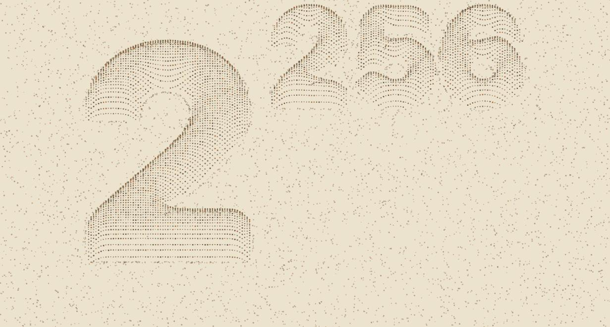
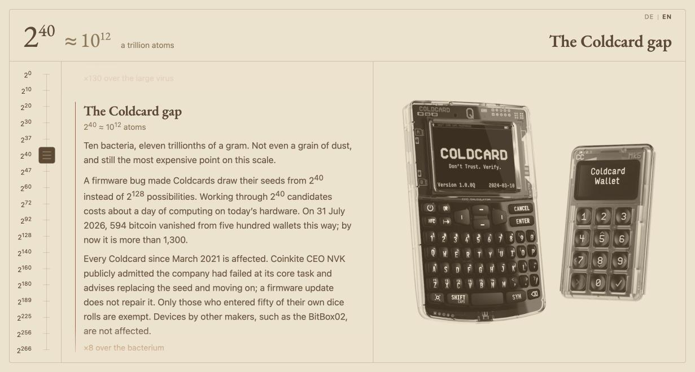

```
           ██████╗ ███████╗ ██████╗  ██████████████▓▒░
           ╚════██╗██╔════╝██╔════╝  ███████████▓▒░
 ██████╗    █████╔╝███████╗███████╗  ████████▓▒░
 ╚════██╗  ██╔═══╝ ╚════██║██╔═══██╗ █████▓▒░
  █████╔╝  ███████╗███████║╚██████╔╝ ██▓▒░
 ██╔═══╝   ╚══════╝╚══════╝ ╚═════╝
 ███████╗
 ╚══════╝  ╞═════ surveying the bitcoin keyspace ════╡
```

# 2^256 · Surveying the Bitcoin keyspace

An interactive visualization of the size of 2^256, the number of possible
Bitcoin private keys, made for readers without a mathematics background.
The pages are drawn like an old topographic survey map: sepia paper, one
family of brown inks, EB Garamond as the engraved lettering.

Live at [tlausz.github.io/keyspace](https://tlausz.github.io/keyspace/).



## The idea

Brains estimate linearly: twice as much, half as much. A number built from
256 doublings escapes that intuition, and ordinary charts do not help;
drawn to scale, every value except the largest collapses into a single
pixel. This project therefore only ever compares neighbours. A grain of
sand holds 8,000 times more atoms than a human cell, Lake Superior 3,100
times more water than Lake Zurich. Each single factor stays graspable, and
eighteen such steps connect one atom to the observable universe.

The project was inspired by the
[Bitcoin Policy Institute](https://www.btcpolicy.org/)'s video
[The Coldcard Bug, Visualized.](https://www.youtube.com/watch?v=IwrKWdxt0YM),
which walks through the same kind of comparisons.

## The zoom

`zoom.html` is the main piece. Its measure: one atom equals one seed.
Eighteen illustrated stations run from a single atom (2^0) through virus,
cell, sand grain, human and ocean up to the observable universe (2^266).
The Bitcoin thresholds sit on the way as ordinary stations, told through
their text rather than through highlighting: the Coldcard gap (2^40),
effective ECDSA security (2^128), the address space (2^160) and the
keyspace itself (2^256), which the universe outgrows by a factor of a
mere thousand.



`index.html` is the entrance: surveyor's dots drift on paper until the
glyph 2^256 presses them aside like a stamp, then an introduction panel
opens and leads into the zoom.

## Controls

- Scrolling travels between stations. Distance counts, not speed: 500
  pixels of scroll per station, so a hard flick still stops at the next
  stop.
- The arrow keys ↑ and ↓ step through the stations as well.
- Every power of two on the left scale is clickable, and the knob beside
  it can be dragged.
- «DE | EN» in the top right switches between German and English in
  place, keeping the current station.

## Running it

There is no build step and there are no dependencies. The font ships in
the repository and the pages make no external requests, so everything
works offline: open `index.html` (or `zoom.html` directly) in a browser
and you are there. The pages honour the operating system's
reduced-motion accessibility setting; with it enabled, all animations
are switched off.

## Image credits

Every station image is a reworked photograph, map or illustration.
[`assets/CREDITS.md`](assets/CREDITS.md) lists author, source, license
and the exact modifications for each one.
